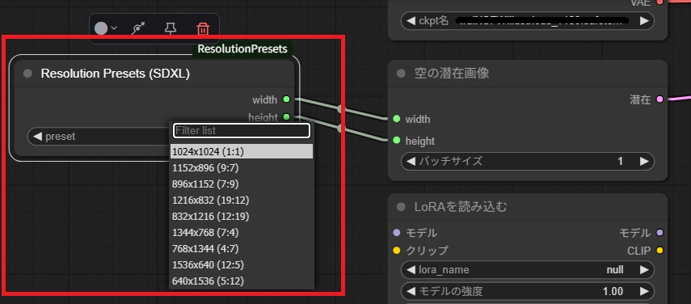

# ComfyUI Resolution Presets



ComfyUI 用の SDXL 推奨解像度プリセットノード。

## 機能

- SDXL 推奨解像度をドロップダウンリストから簡単に選択可能
- 選択した解像度の幅と高さを `width` と `height` として出力
- `Empty Latent Image` ノードなどと組み合わせて使用可能

## インストール

```bash
cd .\custom_nodes
git clone --depth 1 https://github.com/big-mon/ComfyUI-ResolutionPresets.git

# Restart ComfyUI
```

## 使用方法

1. ComfyUI のノード追加メニューから `Resolution Presets (SDXL)` を検索
2. ノードをワークフローに追加
3. ドロップダウンから希望の解像度を選択
4. `width` と `height` の出力を `Empty Latent Image` ノードなどに接続

## 利用可能な解像度

- 1024x1024 (1:1)
- 1152x896 (9:7)
- 896x1152 (7:9)
- 1216x832 (19:12)
- 832x1216 (12:19)
- 1344x768 (7:4)
- 768x1344 (4:7)
- 1536x640 (12:5)
- 640x1536 (5:12)

## ライセンス

MIT License
